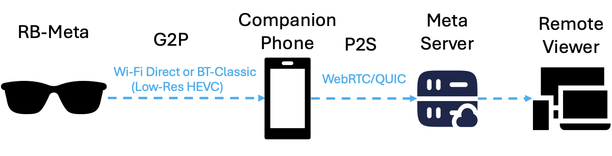
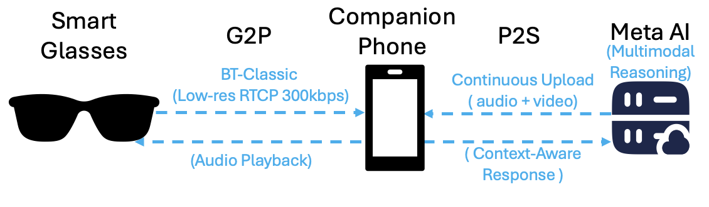
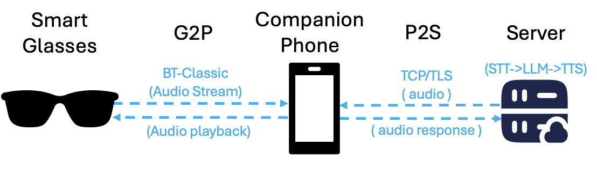
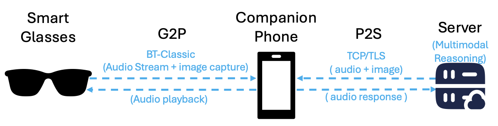

# A First Look at Multimodal Mobile Application Performance on XR and AI Glasses

<p align="center">
  
</p>

<p align="center">
  <em>Communication pipeline of smart glasses: short-range G2P/P2G links to the companion device and P2S/S2P links to cloud servers.</em>
</p>

---

## 📋 Overview

This repository contains the official implementation and supplementary materials for our paper:

> **"A First Look at Multimodal Mobile Application Performance on XR and AI Glasses"**  
> *Anonymous Authors*  
> MobiCom '26

We present the first in-depth measurement study across several smart glasses and core XR and AI applications. Our study dissects the end-to-end pipeline spanning the glass, companion device, and the cloud — revealing how emerging AI and video streaming applications reshape network traffic patterns, companion-device workloads, and quality of experience (QoE).

---

## 🔑 Key Findings

- **Smartphones transcode glass video before upload:** Live streaming from RB-Meta G1 triggers a costly decode–upscale–re-encode pipeline on the companion phone, driving 2–3× higher latency than phone-native streaming. The phone's transcoding — not the G2P wireless link — is the dominant bottleneck.
- **Video conferencing reveals a fundamental upstream/downstream asymmetry:** The companion phone aggressively downscales incoming video for the glass display (600×600, ~20° FoV) while relaying the upstream feed without transcoding.
- **Live AI sacrifices video fidelity for continuous interaction:** Meta Live AI streams at ~300 kbps uplink — an order of magnitude lower than regular live streaming — to sustain always-on multimodal reasoning.
- **No glass meets the real-time AI interaction bar:** All glasses exhibit >1 s end-to-end latency across all five applications, far exceeding the sub-300 ms threshold for real-time interaction.
- **Glass design choices drive a 10× latency disparity:** RB-Meta G1 achieves ~1 s median voice AI latency while Cyan exceeds ~10 s.

---

## 🏗️ System Architecture

<p align="center">
  
</p>

<p align="center">
  <em>System architecture showing communication protocols between Smart Glasses, Companion Device, and Server across different operational modes.</em>
</p>

### Glass Platforms

| Glass | Type | Key Capabilities |
|-------|------|-----------------|
| **RB-Meta G1** | Commercial | Live streaming, AI voice/image, Live AI |
| **RB-Meta Display** | Commercial | Video conferencing (full color display), AI voice/image |
| **Even G1** | Commercial | AI voice (text display only) |
| **Cyan** | Commercial (SDK access) | AI voice/image via custom apps |
| **Dragon** | Custom prototype | Fully instrumented AI voice/image (ESP32-based) |

### Applications Studied

| # | Application | Description |
|---|------------|-------------|
| 1 | **Live Video Streaming** | Continuous camera-to-platform broadcast (Instagram, Facebook) |
| 2 | **Video Conferencing** | Two-way audiovisual calls (WhatsApp, Messenger) |
| 3 | **AI Voice Interaction** | Spoken query → cloud AI → audio response |
| 4 | **AI Voice-Image Interaction** | Spoken query + image capture → multimodal AI → audio response |
| 5 | **Live AI Interaction** | Always-on camera + mic for continuous context-aware AI |

### Measurement Diagrams

| Application | Setup |
|------------|-------|
| Live Video Streaming |  |
| Video Conferencing |  |
| Live AI Interaction |  |
| AI Voice Interaction |  |
| AI Voice-Image Interaction |  |

### Communication Protocols

#### Smart Glasses ↔ Companion Device
- **BLE (Bluetooth Low Energy):** Control signaling and metadata exchange
- **Temp Wi-Fi Network:** High-bandwidth media import
- **Wi-Fi Direct:** Primary channel for live streaming (with BT-Classic fallback)
- **BT-Classic:** Audio streaming and image transmission for AI features

#### Companion Device ↔ Server
- **WebRTC/QUIC:** Low-latency live streaming and video conferencing
- **TCP/TLS (STT + LLM + TTS):** Speech-to-text, LLM inference, and text-to-speech for AI features

---

## 📁 Repository Structure

```
├── ai_voice_image_interaction/             # Audio & image AI interaction latency/throughput notebooks, CSVs, and plots
├── distance_power_logcat/                  # Distance and power measurement data and notebooks (logcat outputs)
├── live_ai_interaction/                    # Meta AI data, notebooks, and generated plots for Live AI tests
├── live_video_streaming-conferencing/      # Live streaming & conferencing notebooks, CPU/throughput-latency data + plots
├── power_tests/                            # Additional power test data and scripts
├── transmission_power_algorithm_Data/      # Adaptive transmission power algorithm data and notebook
├── dragon/                                 # Proprietary application framework for Dragon smart glasses
├── workflow.png                            # System architecture diagram
├── generic_diagram.pdf                     # Generic communication pipeline diagram
├── Measure_liveStreaming.png               # Live streaming measurement setup diagram
├── Measured_VC_Diagram.pdf                 # Video conferencing measurement setup diagram
├── Measure_liveAI.png                      # Live AI measurement setup diagram
├── Measure_AudioAI.png                     # AI voice interaction measurement setup diagram
├── Measure_ImageAI.png                     # AI voice-image interaction measurement setup diagram
└── README.md                               # This file
```

Each analysis folder typically contains Jupyter notebooks and a `Plots/` subfolder for exported figures. See folder-level READMEs for figure-to-notebook mappings.

---

## 🚀 Quick Start — Regenerate Plots

### Prerequisites

- Python 3.8+
- Common libraries: `pandas`, `numpy`, `matplotlib`, `seaborn`, `openpyxl`

```bash
pip install pandas numpy matplotlib seaborn openpyxl
```

### Running Notebooks

All plots are produced by Jupyter notebooks inside the analysis folders:

```bash
# Example: regenerate Live AI plots
cd live_ai_interaction/Meta_AI_Data
jupyter notebook Meta_AI_Bitrate_Plot_Notebook.ipynb
```

Generated figures are saved to the folder's `Plots/` directory. Inspect the first code cell of each notebook to adjust data paths if needed.

---

## 📈 Reproducibility

To reproduce all figures and tables, run the notebooks in each analysis folder. Notebooks load local CSV/Excel/PCAP inputs from the same directory or a `data/` subfolder. We performed cross-platform validation (Meta on iOS vs. Android, Cyan vs. Dragon) to ensure consistency across OS, workloads, and measurement tools.

All data, scripts, and application code are available at: [anonymous link](https://anonymous.4open.science/r/mobicom-26-xr-ai-glass-C362)

---

## 📝 Citation

```bibtex
@inproceedings{anonymous2026firstlook,
  title={A First Look at Multimodal Mobile Application Performance on XR and AI Glasses},
  author={Anonymous},
  booktitle={Proceedings of the ACM International Conference on Mobile Computing and Networking (MobiCom)},
  year={2026}
}
```

---

## 📄 License

This project is licensed under the MIT License — see the [LICENSE](LICENSE) file for details.

---

## 🙏 Acknowledgments

We thank the anonymous reviewers for their valuable feedback. This work was supported by [Institution/Grant details to be added after review].

---

## 📧 Contact

For questions or issues, please open a GitHub issue or contact the authors (contact information will be provided after the anonymous review process).
