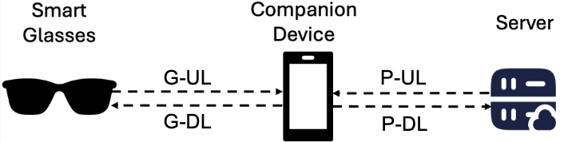
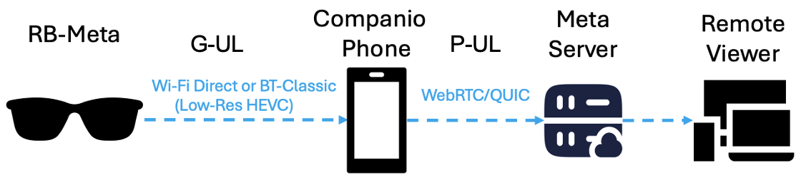
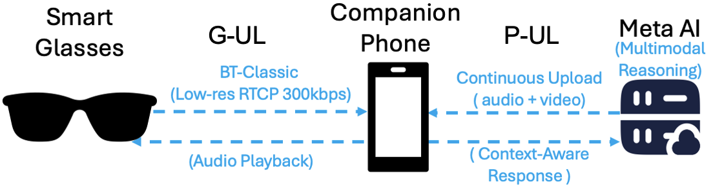
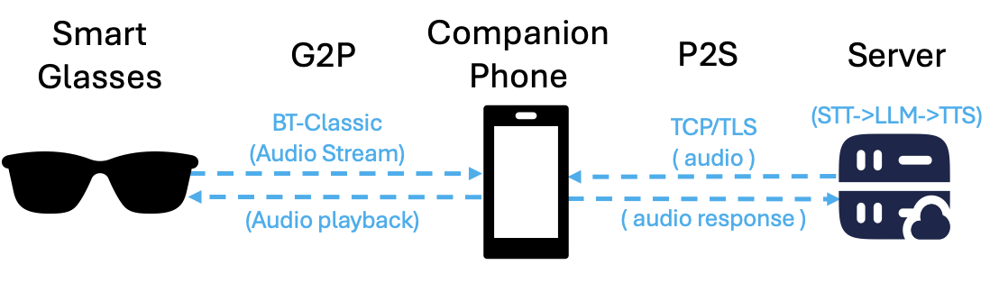
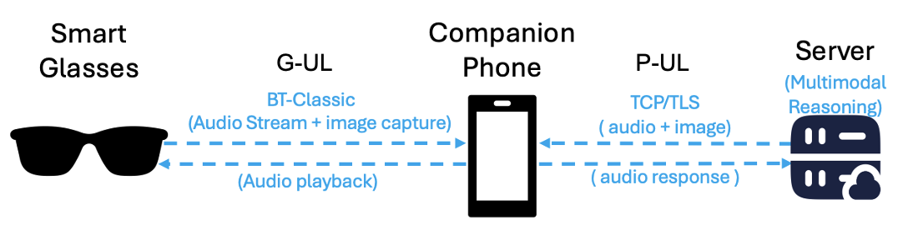

# A First Look at Multimodal Mobile Application Performance on XR and AI Smart Glasses

<p align="center">
  
</p>

<p align="center">
  <em>Communication pipeline of smart glasses: short-range G-UL/G-DL links to the companion device and P-UL/P-DL links to cloud servers.</em>
</p>

---

## Overview

This repository contains the official implementation and supplementary materials for our paper:

> **"A First Look at Multimodal Mobile Application Performance on XR and AI Smart Glasses"**  
> Majd Khalaf, Mathew Garcia, Mayank Chadha, Mallesham Dasari  
> Northeastern University, Boston, Massachusetts, USA  
> MobiCom '26

We present the first in-depth measurement study across several smart glasses and core XR and AI applications. Our study dissects the end-to-end pipeline spanning the glass, companion device, and the cloud, revealing how emerging AI and video streaming applications reshape network traffic patterns, companion-device workloads, and quality of experience (QoE).

---

## Key Findings

- **Smartphones transcode glass video before upload:** Live streaming from RB-Meta G1 triggers a costly decode–upscale–re-encode pipeline on the companion phone, driving 2–3× higher latency than phone-native streaming. The phone's transcoding, not the G-UL wireless link, is the dominant bottleneck.
- **Video conferencing reveals a fundamental upstream/downstream asymmetry:** The companion phone aggressively downscales incoming video for the glass display (600×600, ~20° FoV) while relaying the upstream feed without transcoding.
- **Live AI sacrifices video fidelity for continuous interaction:** Meta Live AI streams at ~300 kbps uplink, an order of magnitude lower than regular live streaming, to sustain always-on multimodal reasoning.
- **No glass meets the real-time AI interaction bar:** All glasses exhibit >1 s end-to-end latency across all five applications, far exceeding the sub-300 ms threshold for real-time interaction.
- **Glass design choices drive a 10× latency disparity:** RB-Meta G1 achieves ~1 s median voice AI latency while Cyan exceeds ~10 s.

---

## System Architecture

### Glass Platforms

| Glass | Type | Key Capabilities |
|-------|------|-----------------|
| **RB-Meta G1** | Commercial | Live streaming, AI voice/image, Live AI |
| **RB-Meta Display** | Commercial | Video conferencing (full color display), AI voice/image |
| **Even G1** | Commercial | AI voice (text display only) |
| **Cyan** | Commercial (SDK access) | AI voice/image via custom apps |
| **Dragon** | Custom prototype | Fully instrumented AI voice/image (ESP32-based) |

### Applications Studied

| # | Application | Description |
|---|------------|-------------|
| 1 | **Live Video Streaming** | Continuous camera-to-platform broadcast (Instagram, Facebook) |
| 2 | **Video Conferencing** | Two-way audiovisual calls (WhatsApp, Messenger) |
| 3 | **AI Voice Interaction** | Spoken query → cloud AI → audio response |
| 4 | **AI Voice-Image Interaction** | Spoken query + image capture → multimodal AI → audio response |
| 5 | **Live AI Interaction** | Always-on camera + mic for continuous context-aware AI |

### Measurement Diagrams

| Application | Setup |
|------------|-------|
| Live Video Streaming |  |
| Video Conferencing |  |
| Live AI Interaction |  |
| AI Voice Interaction |  |
| AI Voice-Image Interaction |  |

### Communication Protocols

#### Smart Glasses ↔ Companion Device
- **BLE (Bluetooth Low Energy):** Control signaling and metadata exchange
- **Temp Wi-Fi Network:** High-bandwidth media import
- **Wi-Fi Direct:** Primary channel for live streaming (with BT-Classic fallback)
- **BT-Classic:** Audio streaming and image transmission for AI features

#### Companion Device ↔ Server
- **WebRTC/QUIC:** Low-latency live streaming and video conferencing
- **TCP/TLS (STT + LLM + TTS):** Speech-to-text, LLM inference, and text-to-speech for AI features

---

## Repository Structure

```
├── ai_voice_image_interaction/             # Audio & image AI interaction latency/throughput notebooks, CSVs, and plots
├── distance_power_logcat/                  # Distance and power measurement data and notebooks (logcat outputs)
├── live_ai_interaction/                    # Meta AI data, notebooks, and generated plots for Live AI tests
├── live_video_streaming-conferencing/      # Live streaming & conferencing notebooks, CPU/throughput-latency data + plots
├── power_tests/                            # Additional power test data and scripts
├── transmission_power_algorithm_Data/      # Adaptive transmission power algorithm data and notebook
├── dragon/                                 # Proprietary application framework for Dragon smart glasses
├── Dockerfile / docker-compose.yml         # Preconfigured environment
├── .devcontainer/                          # Same environment for Codespaces / VS Code
├── requirements.txt                        # Pinned dependencies (authoritative)
├── run_all_notebooks.sh                    # Regenerate every figure in one command
├── generic_diagram.pdf                     # Generic communication pipeline diagram
├── Measure_liveStreaming.png               # Live streaming measurement setup diagram
├── Measured_VC_Diagram.pdf                 # Video conferencing measurement setup diagram
├── Measure_liveAI.png                      # Live AI measurement setup diagram
├── Measure_AudioAI.png                     # AI voice interaction measurement setup diagram
├── Measure_ImageAI.png                     # AI voice-image interaction measurement setup diagram
└── README.md                               # This file
```

Each analysis folder typically contains Jupyter notebooks and a `Plots/` subfolder for exported figures. See folder-level READMEs for figure-to-notebook mappings.

---

## Quick Start: Regenerate Plots

### Docker

```bash
docker build -t xr-ai-glass .
docker run --rm -v "$PWD":/artifact xr-ai-glass ./run_all_notebooks.sh
```

Interactive Jupyter Lab at <http://127.0.0.1:8888/lab?token=mobicom26>:

```bash
docker run --rm -p 127.0.0.1:8888:8888 -e JUPYTER_TOKEN=mobicom26 -v "$PWD":/artifact xr-ai-glass
```

A `docker-compose.yml` and a `.devcontainer/` (GitHub Codespaces, VS Code) wrap
the same environment.

### Local

```bash
pip install -r requirements.txt      # Python 3.12 recommended
./run_all_notebooks.sh               # add a path fragment to run a subset
```

`requirements.txt` is the authoritative dependency list. Note that `scipy` and
`scikit-learn` are required in addition to the packages named in the per-folder
READMEs. `requirements-optional.txt` covers only the `power_tests/` collection
scripts, which need a bench power monitor and an `OPENAI_API_KEY`.

Notebooks load data by relative filename from their own directory, so no paths
need editing. Figures are written to each folder's `Plots/`;
`run_all_notebooks.sh` leaves committed notebooks untouched and writes executed
copies plus logs to `_executed/`.

---

## Reproducibility

The whole suite runs in ~1 minute — no GPU, no network, no API keys. **All 14
notebooks pass**, verified both natively on macOS and in the container. Compare
regenerated figures visually; PNG bytes differ across operating systems because
text rasterization does.

### Where the output goes

Figures are written next to the analysis that produces them:

- `live_video_streaming-conferencing/Plots/`
- `distance_power_logcat/Plots/`
- `live_ai_interaction/Plots/`
- `transmission_power_algorithm_Data/` (alongside the notebook)

`run_all_notebooks.sh` additionally writes an executed copy of each notebook to
`_executed/`, mirroring the repository layout. These copies carry the rendered
figures inline, so opening one in Jupyter shows the results without re-running
anything.

The scripts in `ai_voice_image_interaction/` call `plt.show()` and save no
files. Run them from a notebook cell to see their figures.

### Figure map

Figure numbers refer to the submitted paper. Figures 1, 2, 6, 8, 11 and 15 are
static diagrams in the repository root.

| Figure | Output file | Produced by |
|---|---|---|
| 3 | `live_video_streaming-conferencing/Plots/CDF_Throughput_RB.png` | `live_video_streaming-conferencing/Throughput-Latency_Data/Throughput-Latency-Live-Streaming_Data/Throughput-Live-Streaming_Data/CDF_Throughput_Notebook.ipynb` |
| 4 | `live_video_streaming-conferencing/Plots/Cross_Platforms_Live_Stream_throughput.png` | `live_video_streaming-conferencing/Throughput-Latency_Data/Throughput-Latency-Live-Streaming_Data/Throughput-Bar_Data/Cross-platforms-bar-plot_Notebook.ipynb` |
| 5 | `live_video_streaming-conferencing/Plots/insta_live_codecs_cpu_utilization.png` | `live_video_streaming-conferencing/CPU_Utilization_Data/CPU_Plot_Notebook.ipynb` |
| 7 | `live_video_streaming-conferencing/Plots/Latency_RB_insta_FB_live.png` | `live_video_streaming-conferencing/Throughput-Latency_Data/Throughput-Latency-Live-Streaming_Data/Latency-Live-Streaming_Data/Latency_Percieved_Plot.ipynb` |
| 9a | `live_video_streaming-conferencing/Plots/Latency_RB_Video_Calls.png` | `live_video_streaming-conferencing/Throughput-Latency_Data/Throughput-Latency-Live-Streaming_Data/Latency-Live-Streaming_Data/Latency_Percieved_Plot.ipynb` |
| 9b | `live_video_streaming-conferencing/Plots/Latency_Comparison_Messenger_WhatsApp.png` | `live_video_streaming-conferencing/Throughput-Latency_Data/Meta_Display_Data/Meta_Display_Latency_Plot_Notebook.ipynb` |
| 10a | `live_video_streaming-conferencing/Plots/Meta_Display_Messenger_Throughput_CDF.png` | `live_video_streaming-conferencing/Throughput-Latency_Data/Meta_Display_Data/Meta_Display_Throughput_Plot_Notebook.ipynb` |
| 10b | `live_video_streaming-conferencing/Plots/Meta_Display_WhatsApp_Throughput_CDF.png` | `live_video_streaming-conferencing/Throughput-Latency_Data/Meta_Display_Data/Meta_Display_Throughput_Plot_Notebook.ipynb` |
| 12a | `live_ai_interaction/Plots/Combined_Throughput_Plot.png` | `live_ai_interaction/Meta_AI_Data/Meta_AI_Bitrate_Plot_Notebook.ipynb` |
| 12b | `live_ai_interaction/Plots/Meta_AI_Latency_CDF.png` | `live_ai_interaction/Meta_AI_Data/Meta_AI_Latency Plot_Notebook.ipynb` |
| 13 | displayed, not saved | `ai_voice_image_interaction/audio_total_latency_test.py` |
| 14 | displayed, not saved | `ai_voice_image_interaction/audio_breakdown_latency_test.py` |
| 14a | displayed, not saved | `ai_voice_image_interaction/audio_llm_model_latency_test.py` |
| 18 | `distance_power_logcat/Plots/retransmissions.png` | `distance_power_logcat/Retransmissions_Data/Retransmissions_plot.ipynb` |
| 19 | `distance_power_logcat/Plots/Volt_Battery_Bar_insta_RB.png`, `distance_power_logcat/Plots/Full_time_Battery_insta_RB_original.png` | `distance_power_logcat/Power-Resolution_Data/Power_Plots_Notebook.ipynb` |
| 20 | `distance_power_logcat/Plots/RB_Display_battery_utilization.png` | `distance_power_logcat/Power-Resolution_Data/Power_Plots_Notebook.ipynb` |
| 22 | `distance_power_logcat/Plots/BT_insta_Live_cdf.png`, `distance_power_logcat/Plots/WD_insta_Live_cdf.png`, `distance_power_logcat/Plots/BT_FB_Live_cdf.png`, `distance_power_logcat/Plots/WD_FB_Live_cdf.png` | `distance_power_logcat/Power-Resolution_Data/Resolutions_Plots_Notebook.ipynb` |

Supporting analyses without a numbered figure:
`transmission_power_algorithm_Data/TX_ML_Algo.ipynb` (adaptive TX-power
classifier, writes `transmission_power_algorithm_Data/feature_importance.png`
and `transmission_power_algorithm_Data/optimization_analysis.png`), `distance_power_logcat/Distance_Data/Distance_Latency_plots.ipynb` (Section 5.1),
`live_video_streaming-conferencing/Throughput-Latency_Data/Throughput-Latency-Live-Streaming_Data/Throughput-Live-Streaming_Data/Heatmap_TX.ipynb`.

Hardware-bound and not reproducible without the glasses: new measurements,
`dragon/` (needs the ESP32 prototype), and `power_tests/` (needs the power
monitor and recorded footage). All reported claims rest on the shipped traces.

## License

This project is licensed under the MIT License. See the [LICENSE](LICENSE) file for details.

---

## Acknowledgments

We thank the reviewers for their valuable feedback.

---

## Contact

For questions or issues, please open a GitHub issue or contact Majd Khalaf at khalaf.m@northeastern.edu.
